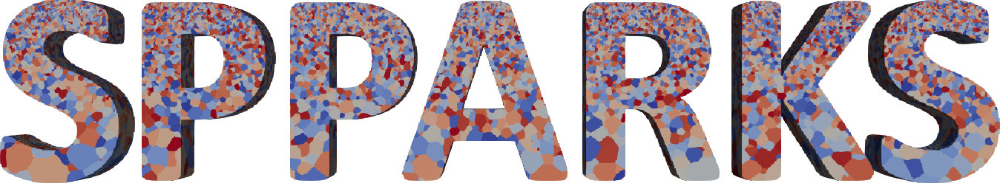
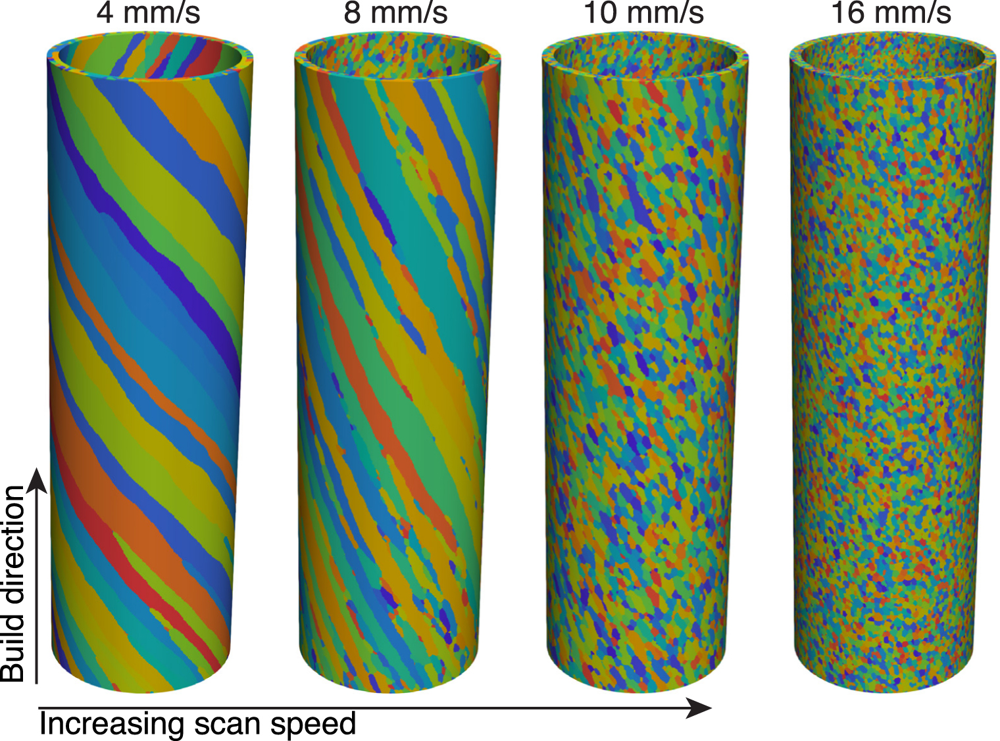
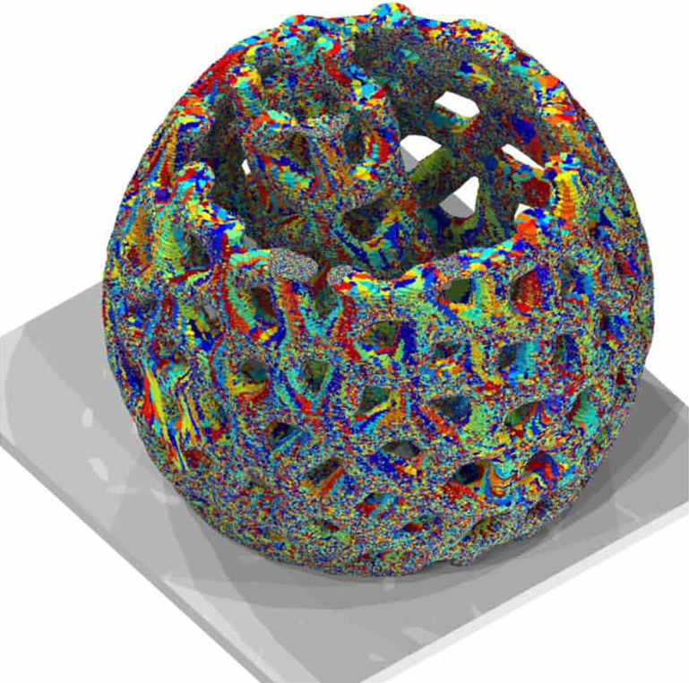

This document describes the technical problem #2 for [the ASME CIE/IDETC 2023 Hackathon event](https://event.asme.org/IDETC-CIE/Program/Student-Hackathon).

# Problem Statement

It is well-known that materials, specifically metals and alloys, exhibit a multi-scale behavior. In this problem, we focus on the meso-scale and macro-scale of an arbitrary solid object that can be modeled through computer-aid design (CAD) packages. Participants are asked to enrich simple CAD objects with microstructure at meso-scale level, using microstructure dataset generated from SPPARKS ([https://spparks.sandia.gov](https://spparks.sandia.gov), [https://spparks.github.io/](https://spparks.github.io/)). The problem can be thought of as synthesizing texture for an arbitrary solid CAD object.

The participants are given

* a collection of CAD models with STL format in [./cad/](cad/) folder,
* and a microstructure dataset generated from SPPARKS ([https://spparks.sandia.gov](https://spparks.sandia.gov)).

The tasks are:

(1) to synthesize microstructure for these solid objects,
(2) and to visualize through any software.

More description is provided in Section [Task](#task) below. Here are two examples for *a simple tube* from [*Theron M Rodgers et al 2018 Modelling Simul. Mater. Sci. Eng. 26 055010*](https://iopscience.iop.org/article/10.1088/1361-651X/aac616/meta) and *an open lattice structure* from [*John A Mitchell
et al 2023 Modelling Simul. Mater. Sci. Eng. 31 055001*](https://iopscience.iop.org/article/10.1088/1361-651X/accc4b)

#  Tasks

Given an object (list of objects listed below - see Section [3D objects](#3d-objects)), generate and visualize that object in 3D with its corresponding microstructure. The participants can pick **as many as 3 objects** to model in this hackathon event. Every object has its own difficulty, ranging from **easy** to **hard**, with different points, which will count towards the final points (see Section [Rubrics - Judgement Criteria](#rubrics)). 

The length scale of the object is around **1 cm**. 

1. Step-1: synthesize a texture for the object based on SPPARKS dataset or SPPARKS, assuming average grain size is 15-20 $\mu$ m. 
1. Step-2: visualize in ParaView (recommended) or OVITO or in any other software package.
1. Step-3 (*Bonus, optional - extra 50%*): generate **multiple** textures for the **same** object. Show 10 different textures for the same object. For each texture, 5% extra points of the object is added.

**Requirements:**

1. Output files must be less than 100 GB each. Please upload the file on a third-party channel. 
2. The texture must be synthesized throughout the object, not just only the surface, but also internally as well. Visualization should clearly communicate this point to obtain full score. Both screenshots and final files are required to evaluate the performance.
3. Must have same output structures as SPPARKS output (see example dataset)

**Visualization:**

1. There are several ways to convert a `np.array` (Numpy array) to a VTK format. 
    * First of all, there is a function from `vtk` package [`vtk.util.numpy_support.numpy_to_vtk()`](https://github.com/Kitware/VTK/blob/0e3d0202115be28c521b3116e664250a8c8368c1/Wrapping/Python/vtkmodules/util/numpy_support.py#L104-L127).
    * Also, there are `pyvista` package [(https://docs.pyvista.org/version/stable/)](https://docs.pyvista.org/version/stable/) and `PyEVTK` package [(https://github.com/pyscience-projects/pyevtk)](https://github.com/pyscience-projects/pyevtk).
2. Participants must visualize, capture, and submit the screenshots for those objects, along with the generated files. 

#  3D objects

What are good 3D objects to model? Typically, we are interested in geometrically complicated object, where additive manufacturing strives. 

Here is the list of objects that you can choose from to model. STL files are available through the GitHub repository.

* **beginner** (*10 pts*): a box of dimension 2 mm x 2 mm x 2 mm
* **intermediate** (*30 pts*): [a hollow tube](./cad/tube.stl) **or** [a dogbone tensile specimen](./cad/dog_bone.stl) **or** [a spring](./cad/spring.stl)
* **hard** (*50 pts*): [a helical gear](./cad/helical_gear.stl) **or** [a turbo blade](./cad/turbo-blade.stl)

# Python CAD modeler

There are several open source software and packages available to view CAD models on Linux. Here are some of the most popular options:

* [FreeCAD](https://www.freecad.org/) - FreeCAD is a free and open source 3D CAD modeling software that can be used to view and edit CAD models. It supports a wide range of file formats, including STEP, IGES, STL, and OBJ, among others.
* [OpenSCAD](https://openscad.org/) - OpenSCAD is a free and open source software for creating and viewing 3D CAD models using a script-based approach. It supports a variety of file formats, including STL, OFF, and DXF.
* [LibreCAD](https://librecad.org) - LibreCAD is a free and open source 2D CAD modeling software that can be used to view and edit CAD drawings. It supports several file formats, including DXF, SVG, and PDF.
* [MeshLab](https://www.meshlab.net/) - MeshLab is a free and open source software for 3D mesh processing and editing. It can be used to view and manipulate CAD models in a variety of file formats, including OBJ, STL, and PLY.
* [QCAD](https://www.qcad.org/en/) - QCAD is a free and open source 2D CAD software that can be used to view and edit CAD drawings. It supports several file formats, including DXF and DWG.
* [CadQuery](https://github.com/CadQuery/cadquery)

These are just a few examples of the open source software and packages available to view CAD models on Linux. Depending on your specific needs, there may be other options available as well.

# Dataset Description

Running SPPARKS on Sandia HPC, uploaded to one of these data server/host:

* [https://zenodo.org/](https://zenodo.org/)
* [https://dataverse.harvard.edu/](https://dataverse.harvard.edu/)
* [https://materialsdata.nist.gov/](https://materialsdata.nist.gov/)
* Sandia external data server.

You can run SPPARKS by yourself to generate data with the [tutorial](#tutorial) or use available datasets (https://dataverse.harvard.edu/dataset.xhtml?persistentId=doi:10.7910/DVN/KJMK9Z, https://doi.org/10.7910/DVN/KJMK9Z )

#  Subject matter experts

* Anh Tran (anhtran@sandia.gov)
* Dehao Liu (dehaoliu@binghamton.edu)
* Theron Rodgers (trodger@sandia.gov)
* John Mitchell (jamitch@sandia.gov)

#  Tutorials for SPPARKS

Note: This section describes how to make and run SPPARKS. It is not required in this hackathon event, as the SPPARKS dataset is already available, but if you would like to generate more data, then you can consider running more SPPARKS simulations.

Note: SPPARKS does not support Windows platform. Compiling and making SPPARKS requires `libjpeg`, C/C++ compiler and MPI. You can download `libjpeg` from [https://ijg.org/](https://ijg.org/) through [this link](https://ijg.org/files/jpegsrc.v9e.tar.gz).

There is an official SPPARKS tutorial at https://spparks.github.io/tutorial/html/index.html.

#  Computational tools

1. SPPARKS (SNL): https://www.spparks.sandia.gov,
2. Generative deep learning (generative adversarial networks, denoising diffusion probabilistic models, etc.),
3. Computer-aided geometry design,
4. Others.

#  How to submit

Step 1: create a GitHub repository that includes

* final presentation - PowerPoint or PDF format
* codes are optional, encouraged but not required
* a link to final results (if the generated dataset is gigantic, please upload through [zenodo.org](https://zenodo.org/))
* pictures of visualization

Step 2: 

* invite idetccie.seikm@gmail.com and anh.vt2@gmail.com as a collaborator to your GitHub repository. We will
    * clone to a local computer or high-performance cluster,
    * run an automated script through your final results,
    * and calculate the points.

#  Rubrics

1. Results (**60%**): (3D objects) 
    * microstructure similarities compared to the generated datasets
    * sum of object points in Section [3D objects](#3d-objects) 
    * complexity of the object geometry
    * complexity of the approach
    * *rescale according to max of 150 pts*.
1. Creativity (**20%**): 
    * critical thinking
    * technical novelty 
    * use of appropriate software for problem solving 
1. Technical presentation (**20%**): 
    * structure and clarity
    * clear and concise explanation of the approaches 

